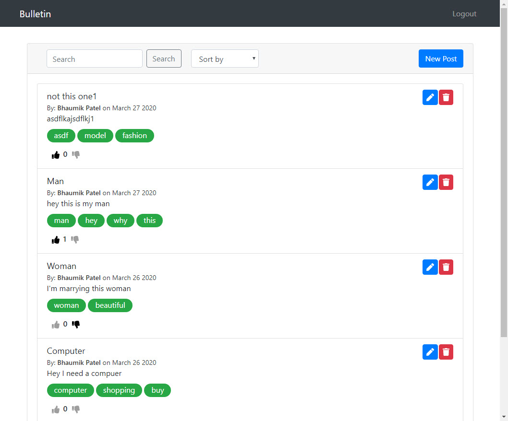

This project was bootstrapped with [Create React App](https://github.com/facebook/create-react-app).

# Available Scripts

In the project directory, you can run:

## Front-end

### `yarn start`

Runs the app in the development mode.<br />
Open [http://localhost:3000](http://localhost:3000) to view it in the browser.



The page will reload if you make edits.<br />
You will also see any lint errors in the console.

### `yarn test:client`

Launches the test runner in the interactive watch mode.<br />
See the section about [running tests](https://facebook.github.io/create-react-app/docs/running-tests) for more information.


### `yarn build`

Builds the app for production to the `build` folder.<br />
It correctly bundles React in production mode and optimizes the build for the best performance.

The build is minified and the filenames include the hashes.<br />
Your app is ready to be deployed!

See the section about [deployment](https://facebook.github.io/create-react-app/docs/deployment) for more information.

## Back-end

### yarn server

Runs the backend in development mode.<br />
The backend server started on port 4000.

```
info: server started on port 4000 (development)
```

The page will reload if you make edits.<br />
You will also see any lint errors in the console.

### yarn test:server

Launches the test runner in the interactive watch mode.<br />
See the section about [running tests](https://github.com/visionmedia/supertest) for more information.
